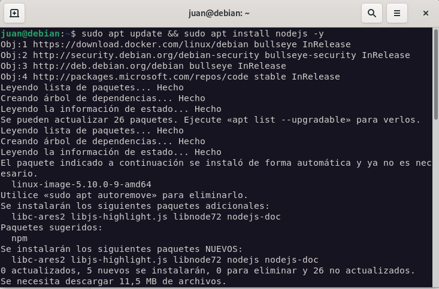
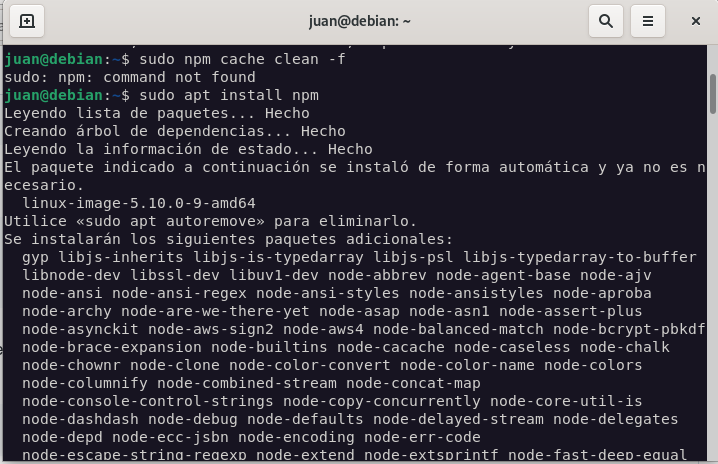
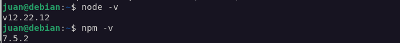
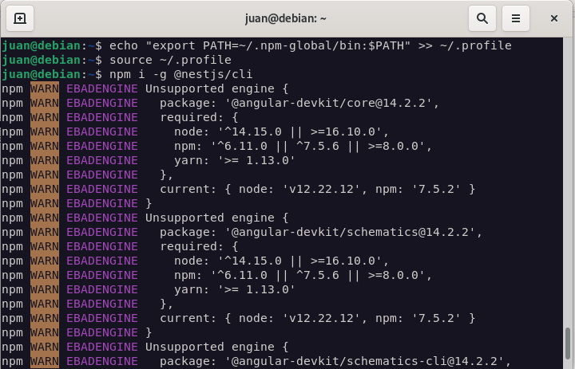
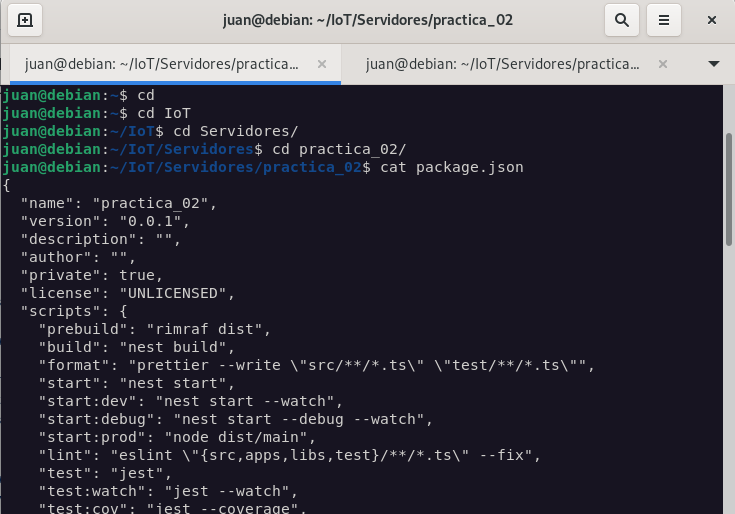
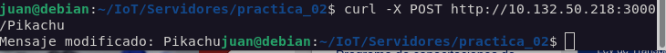
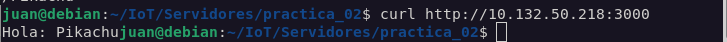

# **Práctica 2: Creando un servidor REST**

En la práctica 1 se exploraron los recursos necesarios para el entorno donde se va desplegar el servidor, hasta ese punto se está cumpliendo con la implementación de internet, donde se cuenta con un recurso de red que expone un puerto TCP/IP para la comunicación con el cliente.

En esta práctica se completará la implementación de un servidor Web, es decir, empleando tecnologías de la World Wide Web expondremos información con el protocolo de Transferencia de Estado Representacional conocido como REST.

# **Objetivos**

1. Instalar servidor NodeJS y NestJS.
2. Implementar un servidor web que exponga un   recurso REST.
3. Publicar en GitHub el código fuente del servidor.
4. Identificar los verbos Http y su uso para un caso de ejemplo.

# **Desarrollo**

1. Instalar NodeJS y NestJS

2. Actualizar Nodejs

3. Validar las versiones instaladas

4. Creando un espacio para los recursos globales en nodejs y Finalmente, para instalar NestJS

# II. Ejecutando el ejemplo Hello World #

1. Crear el proyecto NestJs

2. Verificación de los scripts disponibles

3. La terminal responderá con la siguiente información

# los verbos HTTP #

Creando modificador 

Para validar el cambio en la variable desde el navegador, se debe llamará nuevamente al servidor al método GET como se ha hecho anteriormente. En el navegador se observará el mensaje:

