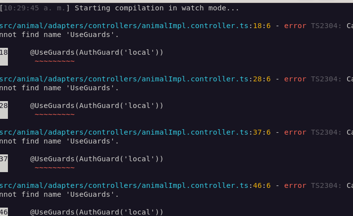
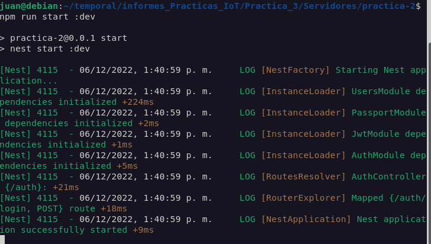

# **Práctica 3: Seguridad y calidad** #
Conseguir que el software funcione es solo la primera parte de crear un producto. Sin embargo, no es suficiente pensando el futuro. El software debe ser robusto, seguro y de calidad. La calidad se refiere a la capacidad de un producto de satisfacer las necesidades de los usuarios. La seguridad se refiere a la capacidad de un producto de protegerse de amenazas externas. La robustez se refiere a la capacidad de un producto de seguir funcionando en condiciones adversas.

En esta práctica vamos a ver cómo podemos asegurar la calidad de nuestro software para garantizar su funcionamiento en el futuro.

# Objetivos #

1. Aplicar los conceptos de arquitectura hexagonal.
2. Implementar protección simple de endpoints.
3. Implementar autenticación JWT.

Al momento de correr el servidor la autenticación me arroja los siguientes errores 

Al verificar falta unas dependencias y queda ok 

finalmente se hace el POST y genera el token 

