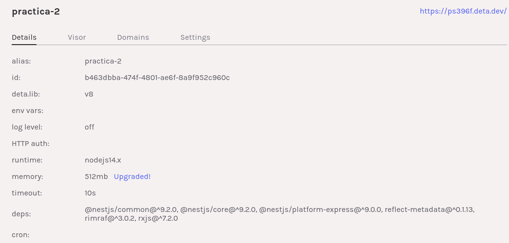
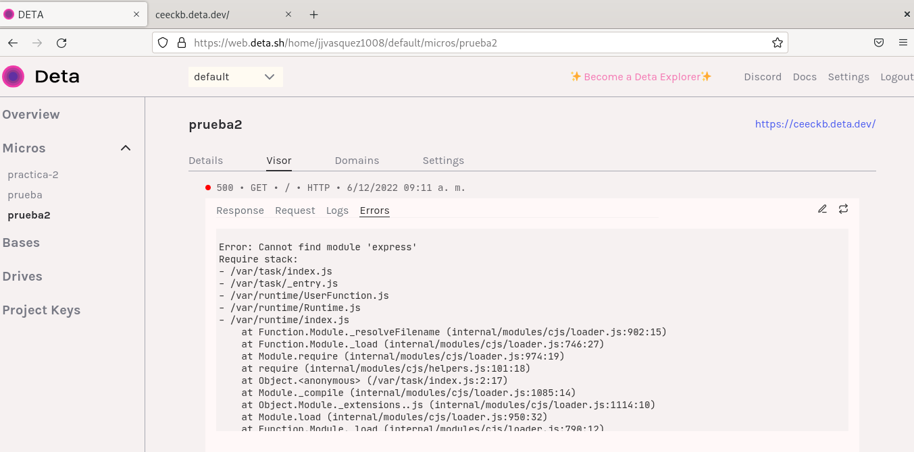
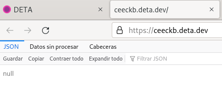

# **Práctica 4: Desplegando en la nube** #

Desarrollar un servidor web en la nube es una tarea relativamente sencilla. En esta práctica vamos a desplegar una aplicación web en la nube utilizando un servicio de hosting gratuito.

# Objetivos

1. Desplegar una aplicación en la nube.
2. Agregar una base de datos a la aplicación.

# Despliegue # 

Desde deta

Al realizar el despliegue se generan errores en la instalación del express, por lo cual se procede a instalarlo con los siguientes comandos. 

npm install express

npm install @types/express --save-dev

Sin embargo, sigue generando el mismo error 

Se crean varios proyectos de prueba pero no es posible solucionar el error.

el link de la practica 4 es: https://ceeckb.deta.dev/

